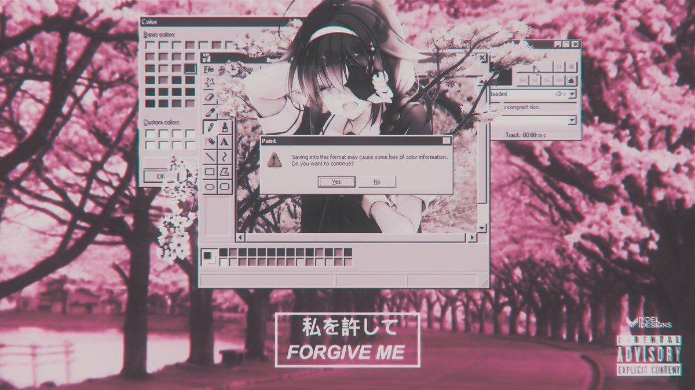

# SensiSafe

    

SensiSafe est une API de détection de contenu inapproprié sur Internet, spécialisée dans la détection d'upload de contenus pornographiques par les utilisateurs. Elle utilise des algorithmes d'apprentissage automatique pour analyser les images téléchargées sur un site web et identifier celles qui contiennent du contenu inapproprié. L'API SensiSafe peut être intégrée facilement à un site web existant pour renforcer la sécurité et la protection des utilisateurs contre les contenus à caractère pornographique. Elle permet également aux propriétaires de sites de contrôler leur contenu et d'agir rapidement en cas de violation des termes et conditions d'utilisation du site. SensiSafe est donc une solution innovante pour améliorer la sécurité en ligne et protéger les utilisateurs de tout âge contre les contenus indésirables.

## How to install 
- Tout d'abord, assurez-vous que Node.js est installé sur votre système. Pour vérifier si Node.js est déjà installé, ouvrez une console et tapez `node -v`. Si vous obtenez une version de Node.js, vous êtes prêt à passer à l'étape suivante. Sinon, vous devrez d'abord installer Node.js.
- Une fois que vous avez Node.js installé, ouvrez une console et naviguez jusqu'au répertoire de votre projet.
- Ensuite, exécutez la commande `npm i` pour initialiser un nouveau projet Node.js. Cette commande va installer les modules sur votre machine
- Configurez votre service: 
  - Changez le port: dans `main.js` (default: 3000)
  - Changez l'image de ban `public/banned.jpg`

## Run
Utilisez [pm2](https://pm2.io/docs/runtime/overview/) pour faire tourner le script sur votre serveur en arriere plan

## API
| URL | Description | body |
| :-- | :---------- | :--- |
| `/api/detect` | Permets de récupérer un JSON afin de pouvoir traiter les données brutes de l'api | "file -> picture_to_analyse"|
| `/api/cadre` | Permets de créé un cadre avec une description sur tout ce qui est détecté par le système | "file -> picture_to_analyse"|
| `/api/blur` | Retourne l'image censurée si besoin ou originale si aucune censure n'a été appliqué | "file -> picture_to_analyse"|
| `/api/ban` | Retourne l'image "banned" si besoin ou originale si aucun contenu pour pornographique n'a été appliqué | "file -> picture_to_analyse"|

## Contributors
- [Sn0wAlice](https://github.com/Sn0wAlice)
- [Lemon 42](https://github.com/lemon-42)

> Script based on the MASTER PEACE OF [this code](https://github.com/vladmandic/nudenet) ❤️